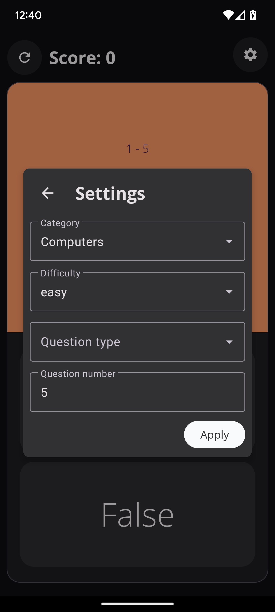
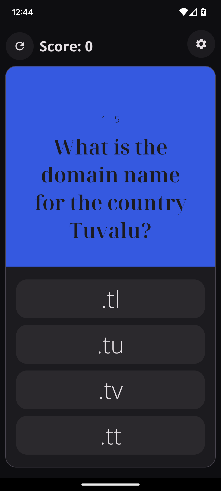
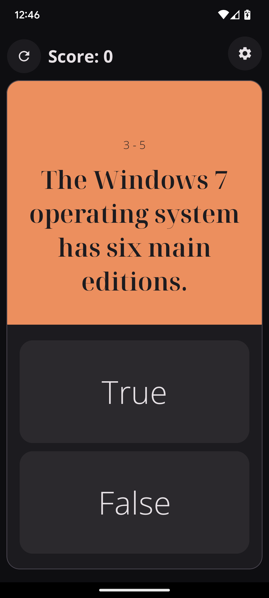
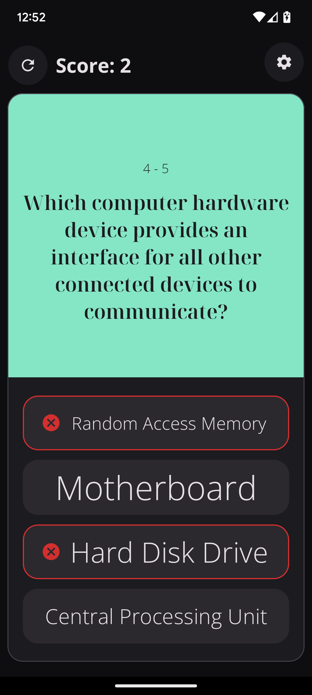
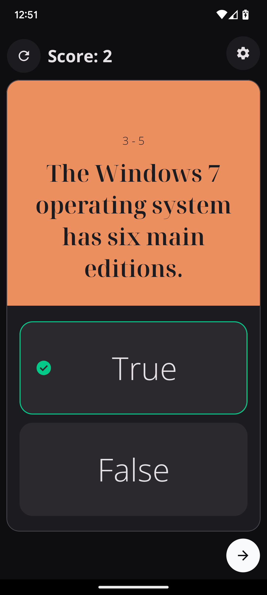
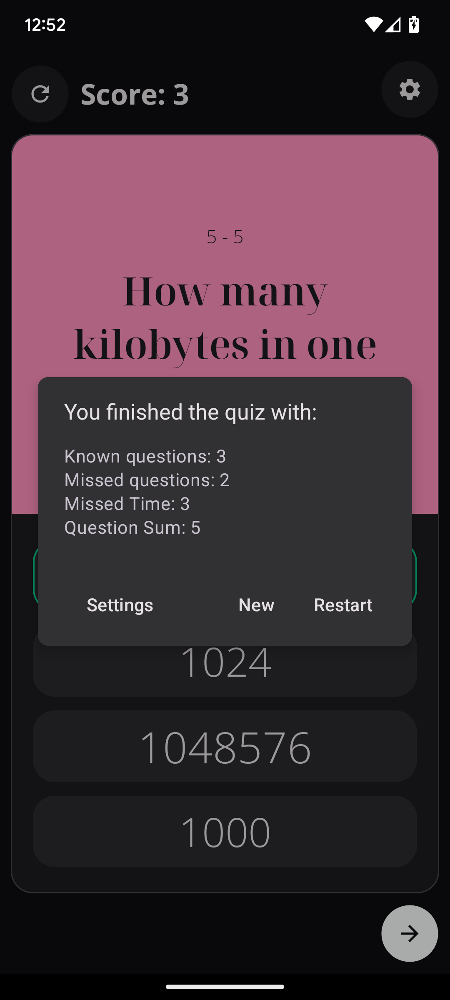

# Open Trivia Quiz

 
 

#
### Presentation: 
This is a quiz app that runs on Android and uses the open trivia database as an api for retrieving questions.

### Tools that I used:
- Kotlin for the code
- XML for the UI
- Retrofit for the API requests
- ViewPager2 for the sliding effect
- SharedPreference () for storing app settings.
- StateFlow/MutableStateFlow for streaming the questions
- OpenTriviaDB for the questions
- MVVM as architecture pattern
